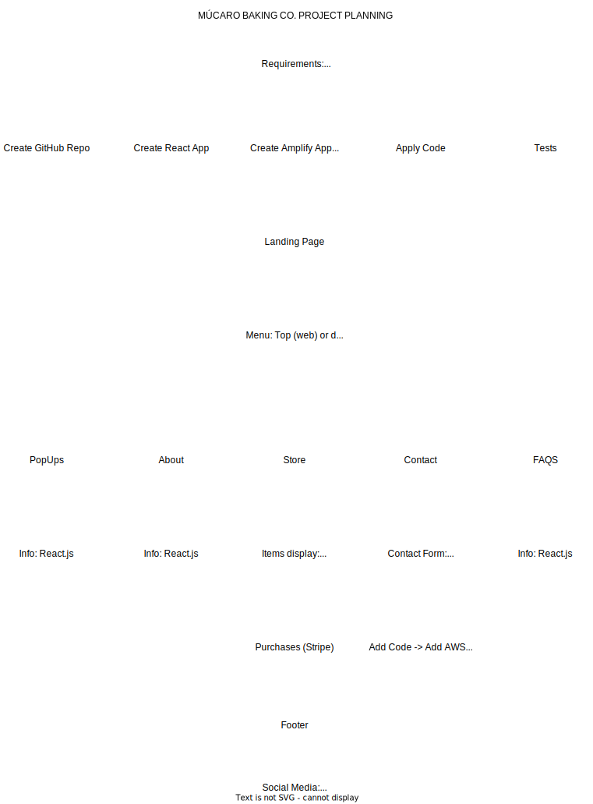

# MUCARO BAKING CO.
### _By Uriel Gonzalez (UGX)_

[](https://viewer.diagrams.net/?tags=%7B%7D&highlight=0000ff&edit=_blank&layers=1&nav=1&title=MucaroBakingCo.drawio#R7VvZcqM4FP0aV2Ue0gUCb4%2FEWXuStCfOVD9OySCDOoCIkGN7vn6u2GyjLExVZ6RiOlWO4WpBnHt0N%2FDAmSXbK46z6I4FJB4gK9gOnPMBQrZr2%2FAlJbtKYiG3lIScBpVsL1jQv0ndsZKuaUDyo46CsVjQ7FjoszQlvjiSYc7Z5rjbisXHV81wSBTBwsexKv1OAxGV0snQ2suvCQ2j%2Bsq2VbUssf8UcrZOq%2BsNkLMq%2FsrmBNdzVf3zCAdscyByLgbOjDMmyqNkOyOxBLeGrRx3%2BUZrs25OUtFlwPPpKPK%2BRiKcW9v8%2BS8%2F2vovp045ywuO16S%2BjWKxYlcDRALAqzplXEQsZCmOL%2FbSswIEIi9jwdm%2Bzy1jGQhtEP4gQuwq5eO1YCCKRBJXrQ008qRcgLzqmzdaiXK25j555%2B5qPmEeEvFOP9SoA3hOWEIE38E4TmIs6MvxOnDFt7Dpt8ccDirY%2F4UKbEUFtzgNaBqCcC7J21bIHm4J1yaigiwyXACxgU36IbQvhAuyfR9cFYxqgDOclEOq%2FY6m4%2FJ8s988dk356GDjTKxPwm%2FYawqjjhR2tVJY5fD%2FUQe2pVUJ%2FbblnZWg15j%2FskYFDHrN0fiXEiQMI51KQIoO7ki6HjgeCB8BQWSdbMjyN%2FhmXOYPnGWAVirld2xJYwJNoxju72wJ7aNQHt2CBmSHmKyEHClXiKxrWDF8xTR9MjtWcm3dsVK%2FN4bbcWNo3ReuooKFYNzwKH841s3caa%2BZO%2BrI3IlO5o4UFdwIkuTSeNM8i%2FGuMO5tm%2F1AsC%2B%2B%2FMjNJvhIexo7UdCdA2kinBOJ8MlCcJpJn2gyihPtDg71Owmqi6YfV7T0ZkGWogVvydbCLPaiupJrjJOz%2B%2B3l7M6Zi1Y%2FVy%2FzQAszlgpwY2bxd4hM4y%2Fqd%2FXD7ppgIL3lDzXFmLPsz0wNwT4g7DG7fzZ9XePY2%2B8qtt01yUB6y9hqmnHp%2FbEwi7ujiWnkdXse%2BE46ktfVG%2FiqWVwTOliXjCcfpMhwVcv7DmS3FheGUb4dbejPmJGaZdykK1aWmN8sOxhlNwwAUQ12TQexnbcZAKIacZkOomschqrp7JMDQ52jr7FOB4Zeib4YE4QrujCq8Dh1OtLX%2FTT6qo%2FWFsynWA68IwHFr3p%2B%2BUDz1PwHl7bVtbD7afg6%2FU7O0LSjeXC0JmdILVDOOMFCPn%2B%2FouJ6vSwcXsbM4nPL2dnaszWn39ma0%2FUxhaM1W3PUBKJhcxG1yWwsyxTNGBX9GkDmfld9HdSVzFqrvvUyXyOzl2QxXe1qOo9wIimbLvOsgKodlZxELC%2Fer8JpMNj%2F8gIWINTBwDug3YH554X5t4T8F5KU8HINUmEJ4ODDcUCymO0SUEX%2BxazdpUQ%2B%2BndXv9%2FZcro%2BU3G0vrXlqBk%2BbKVYLmDGAvXtLaNKdQaQWE0rH0kuDKuJtKtzBuD2WlGkNNcrlooj7EbPa1Y3nObFPpblJ2Rn29LKV%2B21lW%2Fsfi24G8ycwdSbeQ%2FfYNyZ9%2FvN%2FZXk9zew0db84dvXi9mjPLr17u%2BLpnI83NiyPSfIyvXV4paaQUfiWLM4pmEKxz7oinAQSE1SH8de1ZDQIChNGYGbw8tiKmnMMkbBj8h5h2eD4bmcC6xXCUBJE8HZE5mxmMG85ylL5SwrGsct0U9gkD1xjxiEVAK54%2F8ybXbVtPmBPK8pJ4X3fbUoUT6AwL4Pm02UzyTuwcYVJUzrBT7y9Z6zsuGKiuYgku7fpLTPadnB8VTRRhNNH2pj9Gnv%2FqoxmhcEjQ%2BxTpvwqto2VtlcamQfxV2uU19QljYhmje%2FMcuUtl3QZ74ZCKf7X9EWbQe%2FVXYu%2FgE%3D)

Muúcaro Baking Co. is a cloud-hosted website ...

## Features

- Display of events and products
- Company information
- Contact information and contact form
- Online store

## Tech

Múcaro Baking Co. uses a number of technologies to work properly:

- [JavaScript]
- [React]
- [Html] 
- [CSS]
- [AWS] - Amplify: Handles website hosting, automated deployments, functions and APIs
- [AWS] - SES: Handles contact form


## Installation

This repository requires [Node.js](https://nodejs.org/) v10+ to run.
```
git clone https://github.com/Ugonz86/MucaroBakingCo.git
npm install
```

```sh
cd MucaroBakingCo
npm install
npm start
```

## License
MIT

